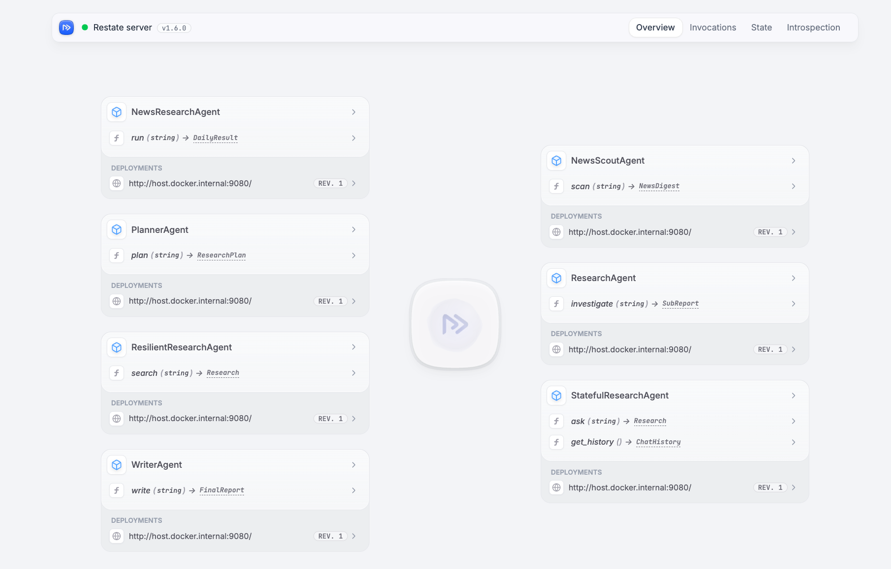

# A long-running research agent with Restate + Tavily + LangChain

🌐 [restate.dev](https://restate.dev) &nbsp;·&nbsp; 📚 [docs.restate.dev](https://docs.restate.dev) &nbsp;·&nbsp; 🤖 [AI agent guides](https://docs.restate.dev/ai) &nbsp;·&nbsp; 📦 [More AI examples](https://github.com/restatedev/ai-examples) &nbsp;·&nbsp; 💬 [Discord](https://discord.gg/skW3AZ6uGd)

---

**Build a research agent that runs for days.** A daily loop that:

- 🔍 scans the news on a topic every morning
- 💬 asks you on Slack which story to dive deeper into
- ⏸️ sleeps for up to 24h waiting for your reply (with no compute held)
- 🚀 fans out a planner + parallel researchers + writer
- 📨 posts the final report to Slack
- 🔁 self-schedules tomorrow's run

All driven by **one durable handler**. No cron, no queue, no session store.

**The stack:**

- **[Restate](https://restate.dev)** — makes every LLM call and tool call durable; suspends handlers for hours without holding compute; fan-out, retries, self-scheduling
- **[LangChain](https://python.langchain.com/)** — `create_agent` for the agent loop, `RestateMiddleware()` to journal every LLM response
- **[Tavily](https://tavily.com)** — `web_search`, `extract_urls`, `crawl_site` for the web tools

The canonical code lives in **`app/`**. We get there in three phases — each adds **one** Restate primitive on top of the previous one:

| Phase | Service | What's new |
|---|---|---|
| 1 — resilient | `ResilientResearchAgent` | Durable LangChain agent. Every LLM + tool call is journaled. Parallel tool calls fan out via `restate.gather`. |
| 2 — session | `StatefulResearchAgent` | Virtual Object keyed by user. Conversation history in `ctx.get`/`ctx.set`. Concurrent calls per key serialize automatically. |
| 3 — autonomous | `NewsResearchAgent` + 4 sub-agents | Daily self-scheduled loop. Slack human-in-the-loop via `ctx.awakeable` + 24h `restate.select` timeout. Planner → N parallel researchers → writer. |

## Phase 1 — `ResilientResearchAgent`: exactly-once LLM + tool execution

The simplest version. A LangChain `create_agent(...)` with the three Tavily
tools, wrapped in a Restate service handler. The middleware journals every
LLM response; each tool wraps its Tavily call in
`restate_context().run_typed(...)`.

```python
agent = create_agent(
    model=init_chat_model("openai:gpt-5"),
    tools=[web_search, extract_urls, crawl_site],
    system_prompt=SYSTEM_RESEARCH,
    response_format=Research,
    middleware=[RestateMiddleware()],
)

resilient = restate.Service("ResilientResearchAgent")

@resilient.handler()
async def search(_ctx: restate.Context, query: str) -> Research:
    result = await agent.ainvoke({"messages": query})
    return result["structured_response"]
```

Without Restate, a crash mid-loop would re-run *every* LLM turn and *every*
tool call from scratch — burning OpenAI tokens and Tavily quota, and
producing different (non-deterministic) results on the retry.

What you get:

- **Journaled steps.** Every model response is recorded in the invocation
  journal by the middleware. Every Tavily call is recorded by
  `restate_context().run_typed(...)`. On replay, completed steps return
  their journaled result instead of re-executing.
- **Exactly-once external calls.** Paid LLM + Tavily calls do not re-execute 
  on retries of subsequent steps.
- **Parallel tool calls stay deterministic.** When the LLM emits N tool
  calls in one turn, Restate journals their outcomes so the agent loop
  replays in a consistent order.

Demo: `kill -9` the Python process mid-search. Restart it. The same
invocation resumes from the last journaled step and finishes the request.

## Phase 2 — `StatefulResearchAgent`: durable conversations, no race conditions

Phase 1's agent, now inside a Virtual Object keyed by user id. Without
Restate you'd need a session store (Redis, Postgres) and a lock per user to
prevent two follow-ups from racing on the same conversation history.

```python
agent = restate.VirtualObject("StatefulResearchAgent")

@agent.handler()
async def ask(ctx: restate.ObjectContext, query: str) -> Research:
    history = await ctx.get("messages") or []
    history.append({"role": "user", "content": query})
    result = await research_agent.ainvoke({"messages": history})
    ctx.set("messages", result["messages"])
    return result["structured_response"]
```

What you get:

- **Per-key state in Restate's KV.** `ctx.get("messages")` / `ctx.set(...)`
  persists the chat history. No external DB.
- **Single-writer per key.** Concurrent calls to
  `StatefulResearchAgent/giselle/ask` serialize automatically — the second
  call waits for the first to finish.
- **State survives crashes.** Restart the process, follow up days later,
  the assistant still remembers earlier turns.

Demo: ask a follow-up after restarting the server — the second source from
the prior turn is still in context.

## Phase 3 — `NewsResearchAgent`: long-running, multi-agent, human-in-the-loop

An autonomous research agent. A daily loop scans the news, posts to Slack, waits up
to 24 hours for the user to request a deep dive, then fans out to parallel
research agents and synthesizes a report. To make this work without Restate, you would
need a queue + scheduler + session store + polling worker.

```python
@agent.handler()
async def run(ctx: restate.Context, topic: str) -> DailyResult:
    ctx.service_send(run, arg=topic, send_delay=timedelta(days=1))

    news = await ctx.service_call(scan, arg=topic)

    awk_id, decision_promise = ctx.awakeable(type_hint=str)
    await ctx.run_typed("slack-news", post_news, topic=topic, digest=news, awk_id=awk_id)

    match await restate.select(
        decision=decision_promise,
        timeout=ctx.sleep(timedelta(days=1)),
    ):
        case ["timeout"]:
            return DailyResult(news=news)
        case ["decision", deep_dive_topic]:
            pass

    research_plan = await ctx.service_call(plan, arg=summarize(deep_dive_topic, news))

    handles = [ctx.service_call(investigate, arg=sub) for sub in research_plan.subtopics]
    await restate.gather(*handles)
    sub_reports = [await h for h in handles]

    report = await ctx.service_call(write, arg=to_brief(deep_dive_topic, research_plan, sub_reports))
    await ctx.run_typed("slack-report", post_report, topic=deep_dive_topic, report=report)
    return DailyResult(news=news, report=report)
```

What you get:

- **Durable suspension.** `ctx.awakeable()` + `restate.select(decision=…,
  timeout=ctx.sleep(timedelta(days=1)))` lets the orchestrator wait
  *up to 24 hours* for the user's Slack reply with **no compute held**.
  When the awakeable resolves (or the timer fires), Restate wakes the
  handler back up exactly where it suspended.
- **Durable fan-out.** Each subtopic spawns a separate `ResearchAgent`
  invocation with its own journal; `restate.gather` waits for all of them.
  If one researcher crashes, only that researcher retries — the others
  keep their journaled progress.
- **Self-scheduling without cron.** `ctx.service_send(run, arg=topic,
  send_delay=timedelta(days=1))` queues tomorrow's run inside Restate. The
  delayed invocation survives server restarts; no external scheduler
  needed.
- **Multi-agent isolation.** Five separate services
  (`NewsScoutAgent`, `PlannerAgent`, `ResearchAgent`, `WriterAgent`,
  `NewsResearchAgent`) each get their own invocations, journals, retry
  policies, and traces in the Restate UI.

Demo: trigger the run, then in the Restate UI watch the orchestrator
sitting suspended on the awakeable for hours while consuming no resources.
Paste the Slack curl, watch the planner → N researchers → writer pipeline
light up. Kill the process during fan-out — the completed researchers stay
done, only the in-flight one replays.

## Phase 4 (optional) — roll your own agent loop

LangChain isn't required. Restate's durability primitives work with any LLM
client. If you want full control over the loop, the same three phases live
in **`app_litellm/`** — identical service names and payloads, but the agent
loop is hand-written against `litellm.acompletion`:

```python
while True:
    response = await ctx.run_typed("llm", call_llm, messages=messages, ...)
    msg = response.choices[0].message
    if not msg.tool_calls:
        return Result.model_validate_json(msg.content)
    handles = [
        ctx.run_typed(tc.function.name, TOOLS[tc.function.name], **json.loads(tc.function.arguments))
        for tc in msg.tool_calls
    ]
    await restate.gather(*handles)
    # append tool results, loop
```

Same Restate APIs (`ctx.run_typed`, `restate.gather`, `ctx.awakeable`,
`ctx.service_send`, `restate.select`); the only difference is you wrap the
LLM call yourself instead of letting `RestateMiddleware` do it. Use this
flavor if you want to swap providers per call, customize the loop, or just
prefer no framework. Swap `litellm` for the OpenAI SDK, Anthropic SDK, or
anything else — the durability story is unchanged.

`app/` and `app_litellm/` register identical service names, so pick **one**
to run at a time.

## Setup

```bash
uv sync
export OPENAI_API_KEY=sk-...
export TAVILY_API_KEY=tvly-...           # https://app.tavily.com
export SLACK_BOT_TOKEN=xoxb-...          # phase 3 only, OPTIONAL — needs chat:write scope
export SLACK_DIGEST_CHANNEL_ID=C...      # phase 3 only, OPTIONAL — invite the bot to the channel
```

If `SLACK_BOT_TOKEN` or `SLACK_DIGEST_CHANNEL_ID` is unset, phase 3 prints
the digest and the final report to the service's stdout instead of posting
to Slack. 

## Run

Restate server in one terminal:

```bash
docker run -p 8080:8080 -p 9070:9070 -p 9071:9071 \
--add-host=host.docker.internal:host-gateway \
docker.restate.dev/restatedev/restate:latest
```

Pick an implementation and run it in another terminal:

```bash
# Canonical LangChain version
cd app && uv run python app/app.py

# — or — manual litellm loop
cd app_litellm && uv run python app_litellm/app.py
```

Register with Restate. Go to the UI at `localhost:9070` and register the service deployment at `http://host.docker.internal:9080`.

The UI then shows all the services that were registered:



## Invoke

```bash
# Phase 1 — stateless single research query
curl localhost:8080/ResilientResearchAgent/search \
  --json '"What changed in Postgres 17 logical replication?"'

# Phase 2 — conversation keyed by user
curl localhost:8080/StatefulResearchAgent/session123/ask \
  --json '"Summarize recent advances in durable execution."'

curl localhost:8080/StatefulResearchAgent/session123/ask \
  --json '"Tell me more about the second source."'

# Phase 3 — autonomous daily news+deep-research loop on a topic
curl localhost:8080/NewsResearchAgent/run --json '"durable execution"'
```

To dive deeper on a digest, copy the curl from the Slack message — it
resolves the awakeable directly via Restate's ingress:

```bash
curl http://localhost:8080/restate/awakeables/<awk_id>/resolve \
  --json '"Tell me more about the second story"'
```

Check the execution trace in the Restate UI:


To stop the daily loop, cancel the pending invocation in the Restate UI
(`http://localhost:9070`).


