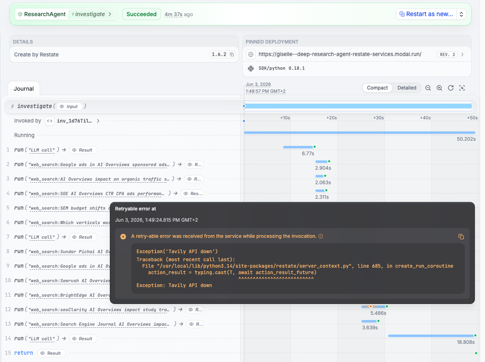
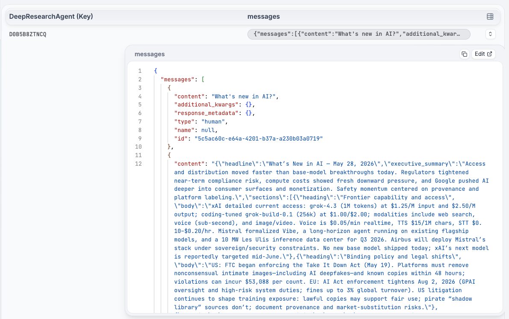
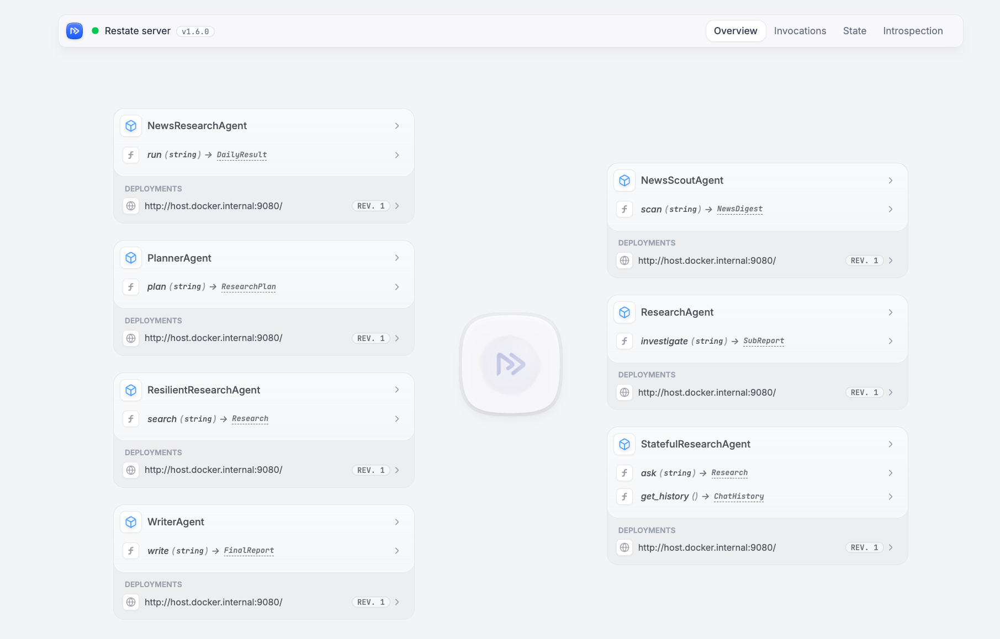

# A long-running research agent with Restate + Tavily + LangChain + Modal

**Build a production-ready, resilient, autonomous research agent that runs for days, weeks, or years.** A Slack-driven loop that:

- 🔍 scans the news on a topic every morning
- 💬 lets you reply in the channel to request a deep dive
- 📋 proposes a research plan and waits (with no compute held) for you to approve it
- 🚀 fans out a planner + parallel researchers + writer
- 📨 posts the final report back to Slack
- 🔁 self-schedules tomorrow's run

All driven by **one durable Virtual Object**. No cron, no queue, no session store, zero infra to manage.

**The stack:**

- **[Restate](https://restate.dev)** — makes every LLM call and tool call durable; suspends handlers for hours without holding compute; fan-out, retries, self-scheduling
- **[LangChain](https://python.langchain.com/)** — `create_agent` for the agent loop, `RestateMiddleware()` to journal every LLM response
- **[Tavily](https://tavily.com)** — `web_search`, `extract_urls`, `crawl_site` for the web tools
- **[Modal](https://modal.com/)** — runs the Restate services as serverless functions that scale to 0 when idle

The canonical code lives in **`app/deep_research.py`** — one file, four
sections that build on each other:

| Section                      | Restate primitive                              | What's new                                                                                                                              |
|------------------------------|------------------------------------------------|-----------------------------------------------------------------------------------------------------------------------------------------|
| 1. Durable Agents            | `restate.Service` + `RestateMiddleware`        | A LangChain agent whose every LLM + tool call is journaled. Parallel tool calls fan out via `restate.gather`. Crashes resume mid-loop.  |
| 2. Durable Agentic Workflows | `ctx.service_call` + `restate.gather` + `awakeable` | Planner → N parallel researchers → writer, with a human-in-the-loop approval gate that suspends with no compute held.                   |
| 3. Durable Sessions          | `restate.VirtualObject` + `ctx.get/set`        | A research agent keyed by Slack channel. Multi-turn history persisted in Restate's KV. Concurrent calls per key serialize automatically. |
| 4. Autonomous Research       | `ctx.object_send(..., send_delay=...)`         | A daily news scout that self-schedules tomorrow's run from inside its own handler — no cron, no scheduler.                              |

## 1. Durable Agents

The starting point: a single LangChain `create_agent(...)` wrapped in a
Restate service handler. `RestateMiddleware` journals every model response;
each Tavily tool wraps its call in `restate_context().run_typed(...)`.

```python
researcher = create_agent(
    model="openai:gpt-5",
    tools=[web_search, extract_urls, crawl_sites],
    system_prompt=RESEARCHER_PROMPT,
    response_format=Report,
    middleware=[RestateMiddleware()],
)

research_agent = restate.Service("ResearchAgent")

@research_agent.handler()
async def investigate(_rst: restate.Context, topic: str) -> Report:
    result = await researcher.ainvoke({"messages": f"Topic: {topic}"})
    return result["structured_response"]
```

Without Restate, a crash mid-loop would re-run *every* LLM turn and *every*
tool call from scratch — burning OpenAI tokens and Tavily quota, and
producing different (non-deterministic) results on the retry.

What you get:

- **Retries & recovery.** Every model response is recorded in the invocation
  journal by the middleware. Every Tavily call is recorded by
  `restate_context().run_typed(...)`. On replay, completed steps return
  their journaled result instead of re-executing.
- **Exactly-once external calls.** Paid LLM + Tavily calls do not re-execute
  on retries of subsequent steps.
- **Parallel tool calls stay deterministic.** When the LLM emits N tool
  calls in one turn, Restate journals their outcomes so the agent loop
  replays in a consistent order.

Demo: You can simulate failures in the Tavily tools by setting the `FAILURE_PROBABILITY = 0.2` in `app/utils/tools.py` 
The Restate UI shows the retries and eventual journaled success:



## 2. Durable Agentic Workflows

One agent isn't enough for a serious research report. The next step composes
several agents into a workflow:

1. **Planner** turns the topic + today's news into a research plan
   (rationale + 3-5 subtopics).
2. **Human approval gate** posts the plan to Slack with Approve / Reject
   buttons and suspends until the user clicks one.
3. **N parallel `ResearchAgent` invocations** investigate each subtopic.
4. **Writer** synthesises the findings into the final report.

```python
async def deep_research(rst, query, history):
    # Plan
    result = await planner.ainvoke({"messages": history.messages})
    plan: ResearchPlan = result["structured_response"]

    # Human approval — suspend on an awakeable, no compute held
    awk_id, decision_promise = rst.awakeable(type_hint=PlanDecision)
    await rst.run_typed("post-plan", post_plan, channel=rst.key(), plan=plan, awk_id=awk_id)
    decision = await decision_promise
    if not decision.approved:
        return AIMessage(content=f"Plan rejected — revise per feedback:\n{plan.model_dump_json()}")

    # Fan out one ResearchAgent per subtopic, in parallel
    handles = [rst.service_call(investigate, arg=sub) for sub in plan.subtopics]
    await restate.gather(*handles)
    sub_reports = [await h for h in handles]

    # Synthesise and deliver
    result = await writer.ainvoke({"messages": to_brief(query, plan, sub_reports)})
    report: FinalReport = result["structured_response"]
    await rst.run_typed("slack-reply", post_report, topic=query, channel=rst.key(), report=report)
    return AIMessage(content=report.model_dump_json())
```

What you get:

- **Durable workflows.** Compose deterministic workflows, where each step
  gets journaled and replayed on retries.
- **Durable suspension on the approval gate.** `ctx.awakeable()` parks the
  workflow until the Slack button click resolves it — potentially hours
  later — with **no compute held**.
- **Durable fan-out.** Each subtopic spawns a separate `ResearchAgent`
  invocation with its own journal; `restate.gather` waits for all of them.
  If one researcher crashes, only that researcher retries — the others
  keep their journaled progress.


## 3. Durable Sessions

Wrap that workflow in a Virtual Object keyed by Slack channel and you get
a stateful, multi-turn research assistant — each channel is its own session.
Without Restate you'd need a session store (Redis, Postgres) and a lock per
session to prevent two follow-ups from racing on the same conversation log.

```python
deep_research_agent = restate.VirtualObject("DeepResearchAgent")

@deep_research_agent.handler()
async def research(rst: restate.ObjectContext, query: str):
    history = await rst.get("messages", type_hint=ChatHistory) or ChatHistory()
    history.messages.append(HumanMessage(content=query))

    response = await deep_research(rst, query, history)

    history.messages.append(response)
    rst.set("messages", history)
```

What you get:

- **Per-key state in Restate's KV.** `ctx.get("messages")` / `ctx.set(...)`
  persists the chat history per channel. No external DB.
- **Single-writer per key.** Concurrent calls to
  `DeepResearchAgent/<channel>/research` serialise automatically — the
  second call waits for the first to finish.
- **State survives crashes.** Restart the process, follow up days later,
  the assistant still remembers earlier turns (and earlier news digests).
- **Plan rejection just works.** If the user clicks Reject, the rejected
  plan is appended to history; the next channel message re-enters the same
  handler with the previous plan in view, so the planner revises.


## 4. Autonomous Research

Bolt one more handler onto the same Virtual Object and the agent becomes
autonomous: every morning it scans the news on a topic, posts the digest to
the channel, and self-schedules tomorrow's run. The user replies in the
channel to trigger a deep dive — which lands in the **same VO** as a
`research` call, so the news context is already in the conversation history.

```python
@deep_research_agent.handler()
async def scan_news(rst: restate.ObjectContext, topic: str):
    result = await news_scout.ainvoke({"messages": f"Topic: {topic}"})
    news: NewsDigest = result["structured_response"]

    await rst.run_typed("slack-news-update", post_news, topic=topic, channel=rst.key(), digest=news)

    # Append today's digest to the session's history so a follow-up
    # "research" call sees the news as context.
    history = await rst.get("messages", type_hint=ChatHistory) or ChatHistory()
    history.messages.append(AIMessage(content=news.model_dump_json()))
    rst.set("messages", history)

    # Self-schedule tomorrow's run on this same channel + topic
    rst.object_send(scan_news, key=rst.key(), arg=topic, send_delay=timedelta(days=1))
```

What you get:

- **Self-scheduling without cron.** `ctx.object_send(scan_news, ...,
  send_delay=timedelta(days=1))` queues tomorrow's run inside Restate. The
  delayed invocation survives server restarts; no external scheduler
  needed.
- **One key, two handlers, shared state.** `scan_news` writes the digest
  into the VO's history; the user's reply (`research`) reads it back —
  same key, automatically serialised.
- **Run forever.** Each daily run schedules the next one before returning,
  so the loop is self-perpetuating. Cancel it from the Restate UI to stop.



## Optional — roll your own agent loop

LangChain isn't required. Restate's durability primitives work with any LLM
client. If you want full control over the loop, the same four sections live
in **`app_litellm/deep_research.py`** with identical service names and
payloads — but the agent loop is hand-written against `litellm.acompletion`:

```python
async def run_agent(ctx, *, messages, output_model, use_tools=True, max_turns=3):
    msgs = list(messages)
    for _ in range(max_turns):
        response = await ctx.run_typed("llm", call_llm, messages=msgs,
                                        output_model=output_model,
                                        tools=TOOL_SPECS if use_tools else None)
        msg = response.choices[0].message
        msgs.append(msg.model_dump(exclude_none=True))
        if not msg.tool_calls:
            return output_model.model_validate_json(msg.content)
        handles = [
            ctx.run_typed(tc.function.name, TOOLS[tc.function.name],
                          **json.loads(tc.function.arguments))
            for tc in msg.tool_calls
        ]
        await restate.gather(*handles)
        # append tool results, loop
```

Same Restate APIs (`ctx.run_typed`, `restate.gather`, `ctx.awakeable`,
`ctx.object_send`); the only difference is you wrap the LLM call yourself
instead of letting `RestateMiddleware` do it. Swap `litellm` for the OpenAI
SDK, Anthropic SDK, or anything else — the durability story is unchanged.

## Run locally
### 1. Setup

```bash
uv sync
export OPENAI_API_KEY=sk-...
export TAVILY_API_KEY=tvly-...          
```

When running locally, all Slack messages (news digest, plan approval, final report) are printed to 
the service's stdout instead — with ready-to-paste `curl` commands for the awakeables.

### 2. Launch the app

Run the Restate Server in one terminal:

```bash
docker run -p 8080:8080 -p 9070:9070 -p 9071:9071 \
--add-host=host.docker.internal:host-gateway \
docker.restate.dev/restatedev/restate:latest
```

Pick an implementation and run it in another terminal:

```bash
uv run app

# — or — manual litellm loop
uv run app_litellm
```

Register with Restate. Go to the UI at `localhost:9070` and register the
service deployment at `http://host.docker.internal:9080`.

The UI then shows all the services that were registered:



### 3. Invoke

```bash
# Trigger an autonomous daily news+deep-research loop for channel "C123" on a topic
curl localhost:8080/DeepResearchAgent/C123/scan_news/send --json '"AI"'

# Ad-hoc research call on the same channel (uses any news already in the session)
curl localhost:8080/DeepResearchAgent/C123/research --json '"Tell me more about the second story"'
```

When the planner posts a plan, copy the Approve / Reject curl from the
service log — it resolves the awakeable directly via Restate's ingress:

```bash
curl http://localhost:8080/restate/awakeables/<awk_id>/resolve --json '{"approved": true}'
```

To stop the daily loop, cancel the pending invocation in the Restate UI
(`http://localhost:9070`).

## Deploy to Restate Cloud + Modal

You can run production-grade research agents without managing any infra by using
[Restate Cloud](https://restate.dev) and [Modal](https://modal.com) (or any other serverless functions provider):

- **Restate Cloud** ([restate.dev](https://restate.dev)) hosts the durable broker — journals, KV state, timers, awakeables, retries.
- **[Modal](https://modal.com)** hosts the Python services as a single ASGI endpoint. Restate Cloud calls into it over HTTP/2.

The repo includes `modal_app.py` at the project root that wraps the same
`restate.app([...])` from `app/__main__.py` as a Modal ASGI app, plus a
companion Slack webhook function that wires Slack events through to the
Restate ingress.

For more information, read the [`docs/deploy-to-modal.md`](docs/deploy-to-modal.md) doc.